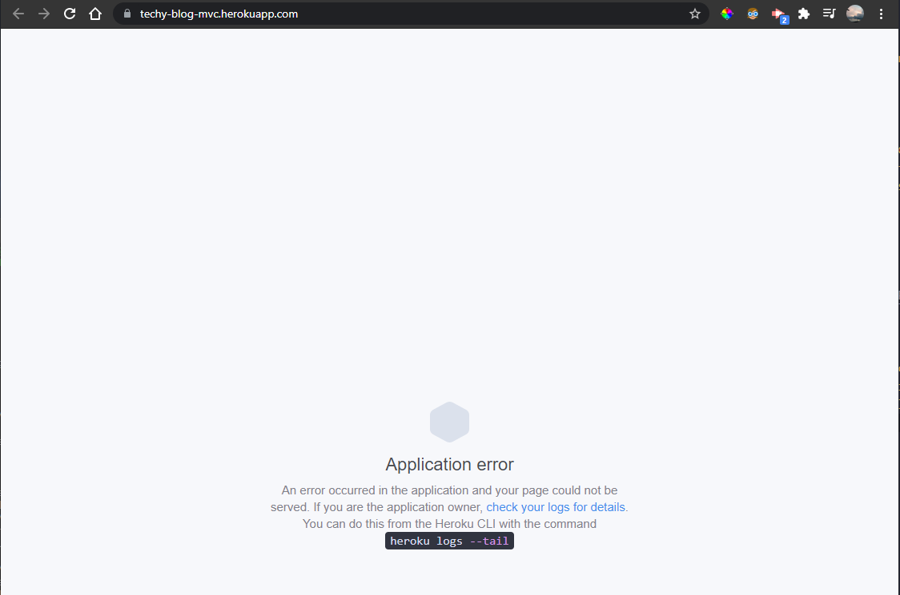
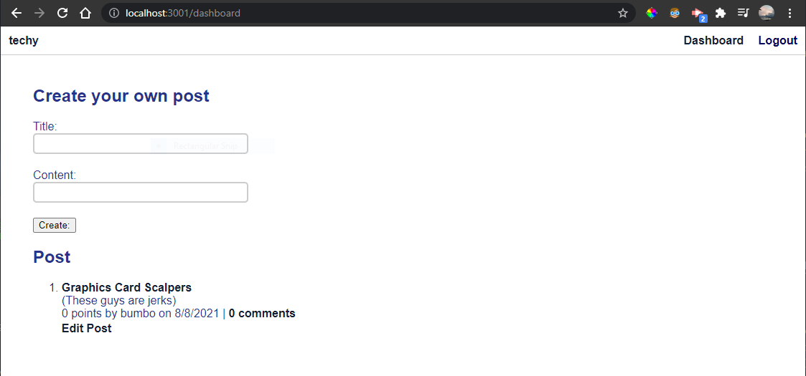

# techy-blog

## About This Project

#### The Techy blog is a web application that allows you to log in and create, edit, or delete posts while interacting with a find end. You can also leaves comments on posts and upvote the post.

## How it works:

#### You can visit the app at a live heroku link, log in, or register a new account and from there you have access to see posts from different users and interact with them through the comments or make your own post

### Unsuccessful Heroku connection

### Successful localhost connection

## Challenges:

#### I ran into issues getting the application to launch on heroku. I kept getting an error saying that the server could not find the models module through the file path that I set up when connecting all the files. However the application works with no issues on the localhost connection.
